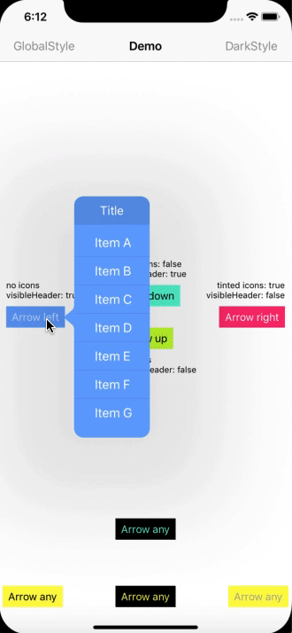

# SimplePopUpMenu

[](https://travis-ci.org/mmachado53/SimplePopUpMenu)
[](https://cocoapods.org/pods/SimplePopUpMenu)
[](https://cocoapods.org/pods/SimplePopUpMenu)
[](https://cocoapods.org/pods/SimplePopUpMenu)

Simple but customizable popup menu in swift



## Example

To run the example project, clone the repo, and run `pod install` from the Example directory first.

## Requirements

## Installation

SimplePopUpMenu is available through [CocoaPods](https://cocoapods.org). To install
it, simply add the following line to your Podfile:

```ruby
pod 'SimplePopUpMenu'
```

## Author

mmachado53, mmachado53@gmail.com

## Usage 
``` swift
// YourUIViewControllerInstance.swift
import SimplePopUpMenu

@IBAction func tapButtonAction(_ sender:UIButton){

    let popUpMenu:PopUpMenuUIViewControler = PopUpMenuUIViewControler()
    /* Manage header of popupmenu */
    popUpMenu.title = "Menu title"
    popUpMenu.visibleHeader = true //default is false
    
    /* Manage menu items */
    var items:[PopUpMenuItem] = []
    // item without icon
    items.append(PopUpMenuItem(title: "Item A"))
    // item with icon
    items.append(PopUpMenuItem(title: "Item B",uiImage: uiImageInstance))
    // item with tinted icon
    items.append(PopUpMenuItem(title: "Item C",uiImage: uiImageInstance, tintImage:true))

    /*Show menu*/
    //permittedArrowDirections its a UIPopoverArrowDirection can be .up, .down, .left, .right, .any
    popUpMenu.showMenu(menuIdentifier: "menu1", viewController: self, items: items, sourceView: sender,permittedArrowDirections: .any)
}

```

### Listening when an item is selected
There are two ways to listen to the selection of an item

#### Simple CallBack
 ``` swift
 // YourUIViewController.swift
 import SimplePopUpMenu
 
 @IBAction func tapButtonAction(_ sender:UIButton){
 
     let popUpMenu:PopUpMenuUIViewControler = PopUpMenuUIViewControler()
     
     let items:[PopUpMenuItem] = [
            PopUpMenuItem(title: "Item A"),
            PopUpMenuItem(title: "Item B")
        ]
     popUpMenu.showMenu(menuIdentifier: "menu1", viewController: self, items: items, sourceView: sender,permittedArrowDirections: .any)
     
    popUpMenu.setHandler { (selectedMenuIndex) in
        print("selectedMenuIndex \(selectedMenuIndex)")
        print("selectedMenuText \(items[selectedMenuIndex].title)")
     }
 }
 
 ```


#### With a Delegate
 ``` swift
 // YourUIViewController.swift
 import SimplePopUpMenu
 
 @IBAction func tapButtonAction(_ sender:UIButton){
 
     let popUpMenu:PopUpMenuUIViewControler = PopUpMenuUIViewControler()
     
     let items:[PopUpMenuItem] = [
            PopUpMenuItem(title: "Item A"),
            PopUpMenuItem(title: "Item B")
        ]
     popUpMenu.showMenu(menuIdentifier: "menu1", viewController: self, items: items, sourceView: sender,permittedArrowDirections: .any)
     popUpMenu.delegate = self
 }

extension YourUIViewController : PopUpMenuDelegate{
    func popupmenu(selectItem: Int, menuIdentifier: String) {
        print("menuIdentifier \(menuIdentifier), selectedIndex: \(selectItem)")
    }
    
    
}
 
 ```

## Customize colors

### Global colors customization
It has to be configured in the AppDelegate
``` swift
// AppDelegate.swift

import SimplePopUpMenu

func application(_ application: UIApplication, didFinishLaunchingWithOptions launchOptions: [UIApplicationLaunchOptionsKey: Any]?) -> Bool {
    
    
    /* 
        All Application default popupmenu colors   
    */
    var popUpMenuStyle:PopUpMenuStyle = PopUpMenuStyle()
    // Color of all popup view
    popUpMenuStyle.baseColor = UIColor.white  
    // Color of the items texts                          
    popUpMenuStyle.textColor = UIColor.black
    // Background color of the header view
    popUpMenuStyle.headerColor = UIColor.black
    // Color of the header text 
    popUpMenuStyle.headerTextColor = UIColor.white
    // Color of separator
    popUpMenuStyle.itemSeparatorColor = UIColor.black
    // Background color of the item when is selected
    popUpMenuStyle.selectedBackgroundColor = UIColor.black.withAlphaComponent(0.1)
    
    // Set te global style
    PopUpMenuUIViewControler.globalStyle = popUpMenuStyle
    
    
    
    return true
}
```

### Instance colors customization

 ``` swift
 // YourUIViewController.swift
 import SimplePopUpMenu

let myCustomPopUpStyle:PopUpMenuStyle = {
        var result:PopUpMenuStyle = PopUpMenuStyle()
        result.baseColor = UIColor.white  
        result.textColor = UIColor.black
        result.headerColor = UIColor.black
        result.headerTextColor = UIColor.white
        result.itemSeparatorColor = UIColor.black
        result.selectedBackgroundColor = UIColor.black.withAlphaComponent(0.1)
        return result
    }()
 
 @IBAction func tapButtonAction(_ sender:UIButton){
 
     let popUpMenu:PopUpMenuUIViewControler = PopUpMenuUIViewControler()
     popUpMenu.style = myCustomPopUpStyle
     let items:[PopUpMenuItem] = [
            PopUpMenuItem(title: "Item A"),
            PopUpMenuItem(title: "Item B")
        ]
     popUpMenu.showMenu(menuIdentifier: "menu1", viewController: self, items: items, sourceView: sender,permittedArrowDirections: .any)
 }
 
 ```


## License

SimplePopUpMenu is available under the MIT license. See the LICENSE file for more info.
